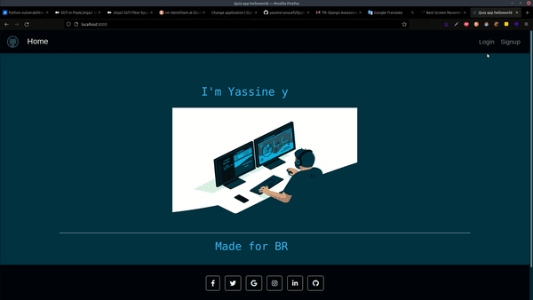
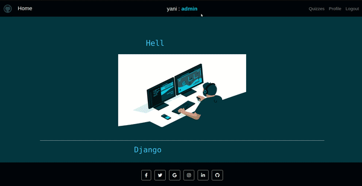
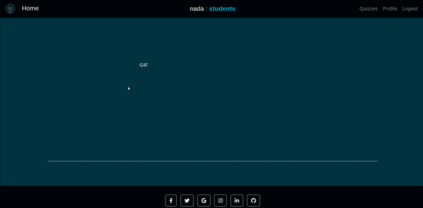

# Quiz
Quiz management application 

[application link](https://quizyani.herokuapp.com/)


# 1- Web interface :
- The web application has authentication with two roles (admin,students)

 

### Admin :
Can create, update and delete quizzes, and also be able to create questions and answers ro each quiz, each admin can control his own quizzes.

- Note : I applied some modifications concerning the specifications, when the answers have a boolean field which represents is the answer is correct or not , and the system will be calcul the user results and save it later   

 

### Students :
The student after having connected to his session, he will be able to choose one of the quizzes, then click to start, after having applied his own answers the results will be displayed.

- Note:
the students must respect the tempt of the exam, if not the exam will be kept in the state or the time and finish

 

### Next : add the result page and custom answers.

--- 
---

# 2- CRUD APIs :

## _Oauth VIEWS_ :

OAuthLib - Python Framework for OAuth1 & OAuth2
## 1. Get access_token  :

```http
  POST /api/o/token/
```
| Endpoint  | Body   | Description                                                                                                                                                                                                                                         |
| :-------- | :----- | :-------------------------------------------------------------------------------------------------------------------------------------------------------------------------------------------------------------------------------------------------- |
| `` | `None` | post the body in this url will give u access and refresh token ,  = 201 |

### Body

```json
{
    "client_id":"wR3ge51oTHbzcEHX6B4XTW5zeo1dqvq5OWKn5mct",
    "username":" ... ",
    "password":" .... ",
    "grant_type":"password"
}

```
### Responce

```json
{
    "access_token": "Qk2ZMXR1 ... ",
    "expires_in": 36000,
    "token_type": "Bearer",
    "scope": "read write",
    "refresh_token": "Xx0EDrQiLHIu ... "
}


```

## _Quizzes VIEWS_ :
## 1. All Quizzes  :

```http
  GET /api/quizzes/
```
| Endpoint  | Body   | Description                                                                                                                                                                                                                                         |
| :-------- | :----- | :-------------------------------------------------------------------------------------------------------------------------------------------------------------------------------------------------------------------------------------------------- |
| `quizzes()` | `None` | The QuizListView view return all Quiz  instances,  = 200 |

### Responce

```json
[
    {
        "id": 7,
        "name": "AI",
        "topic": "machin learning",
        "number_of_questions": 2,
        "time": 2,
        "required_score": 100
    },
    {
        "id": 8,
        "name": "oauth2",
        "topic": "authentication",
        "number_of_questions": 2,
        "time": 2,
        "required_score": 100
    }
]    

```
---


## 2.  Quizz detail  :

```http
  GET /api/quiz/<pk>
```
| Endpoint  | Body   | Description                                                                                                                                                                                                                                         |
| :-------- | :----- | :-------------------------------------------------------------------------------------------------------------------------------------------------------------------------------------------------------------------------------------------------- |
| `quiz()` | yes | The QuizView view return Quiz details  instances,  = 200 |

### Responce

```json
{
    "id": 7,
    "admin": 1,
    "name": "AI",
    "topic": "machin learning",
    "number_of_questions": 2,
    "time": 2,
    "required_score": 100
}

```
---
## _Questions VIEWS_ :

## 1. All questions  :

```http
  GET /api/questions/
```
| Endpoint  | Body   | Description                                                                                                                                                                                                                                         |
| :-------- | :----- | :-------------------------------------------------------------------------------------------------------------------------------------------------------------------------------------------------------------------------------------------------- |
| `questions()` | `None` | The QuestionsListView view return all Questions instances,  = 200 |

### Responce

```json
[
    {
        "id": 8,
        "question_type": "MCQ",
        "quiz": 7,
        "text": "witch language is best for AI ?",
        "answer": [
            {
                "user": 1,
                "question": 8,
                "text": "c++"
            },
            {
                "user": 1,
                "question": 8,
                "text": "java"
            },
           
        ]
    }
]    

```
---


## 2.  Question details  :

### GET method :
```http
  GET /api/question/<pk>/
```
| Endpoint  | Body   | Description                                                                                                                                                                                                                                         |
| :-------- | :----- | :-------------------------------------------------------------------------------------------------------------------------------------------------------------------------------------------------------------------------------------------------- |
| `question()` | `None` | The QuestionView view return Question details instances,  = 200 |

#### Responce

```json
{
    "id": 9,
    "question_type": "MCQ",
    "quiz": 7,
    "text": "what is SVM ?",
    "answer": [
        {
            "user": 1,
            "question": 9,
            "text": "web application"
        },
        {
            "user": 1,
            "question": 9,
            "text": "machin learning algo"
        }
        
    ]
}
```


### POST method :

```http
  POST /api/question/
```
| Endpoint  | Body   | Description                                                                                                                                                                                                                                         |
| :-------- | :----- | :-------------------------------------------------------------------------------------------------------------------------------------------------------------------------------------------------------------------------------------------------- |
| `question()` | yes | The QuestionCreateView view create Question  instances,  = 201 |

#### Body

```json
{
    "id": 9,
    "question_type": "MCQ",
    "quiz": 7,
    "text": "what is SVM ?",
    "answer": []
}
```
---

## 3. all questions  :


```http
  GET /api/questions/
```
| Endpoint  | Body   | Description                                                                                                                                                                                                                                         |
| :-------- | :----- | :-------------------------------------------------------------------------------------------------------------------------------------------------------------------------------------------------------------------------------------------------- |
| `questions()` | `None` | The QuestionsListView view return all Questions instances,  = 200 |

### Responce

```json
[
    {
        "id": 8,
        "question_type": "MCQ",
        "quiz": 7,
        "text": "witch language is best for AI ?",
        "answer": [
            {
                "user": 1,
                "question": 8,
                "text": "c++"
            },
            {
                "user": 1,
                "question": 8,
                "text": "java"
            },
           
        ]
    }
]    

```
--- 

## _Answers VIEWS_ :


## 1. question Answers  :


### GET method :

```http
  GET /api/question/<int:pk>/answers/
```
| Endpoint  | Body   | Description                                                                                                                                                                                                                                         |
| :-------- | :----- | :-------------------------------------------------------------------------------------------------------------------------------------------------------------------------------------------------------------------------------------------------- |
| `answers()` | `None` | The AnswersListView view return all Answer  instances,  = 200 |

### Responce

```json
[
   {
        "id": 10,
        "question": 8,
        "text": "c++"
    },
    {
        "id": 11,
        "question": 8,
        "text": "java"
    }
]    

```
---


### POST method :

```http
  POST /api/question/<int:pk>/answers/
```
| Endpoint  | Body   | Description                                                                                                                                                                                                                                         |
| :-------- | :----- | :-------------------------------------------------------------------------------------------------------------------------------------------------------------------------------------------------------------------------------------------------- |
| `answers()` | `None` | The AnswersListView view create answer instances,  = 201 |

### Body

```json
{
"text": "c++"
}    

```
---


## 2. delete Answers  :


```http
  DELETE /api/answers/<pk>/
```
| Endpoint  | Body   | Description                                                                                                                                                                                                                                         |
| :-------- | :----- | :-------------------------------------------------------------------------------------------------------------------------------------------------------------------------------------------------------------------------------------------------- |
| `answers()` | `None` | This view return will delete Answer instances,  = 201 |

---

